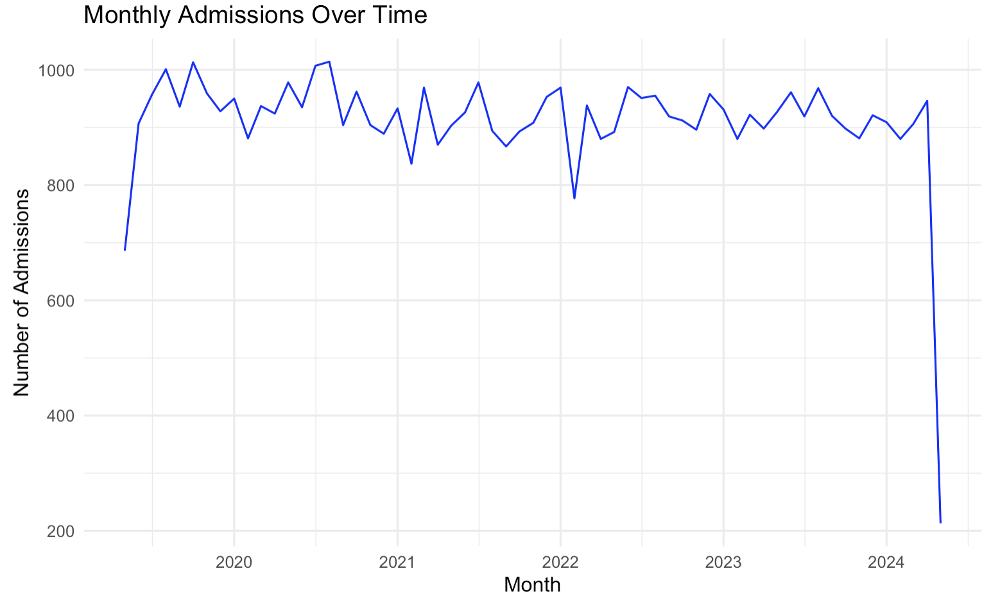
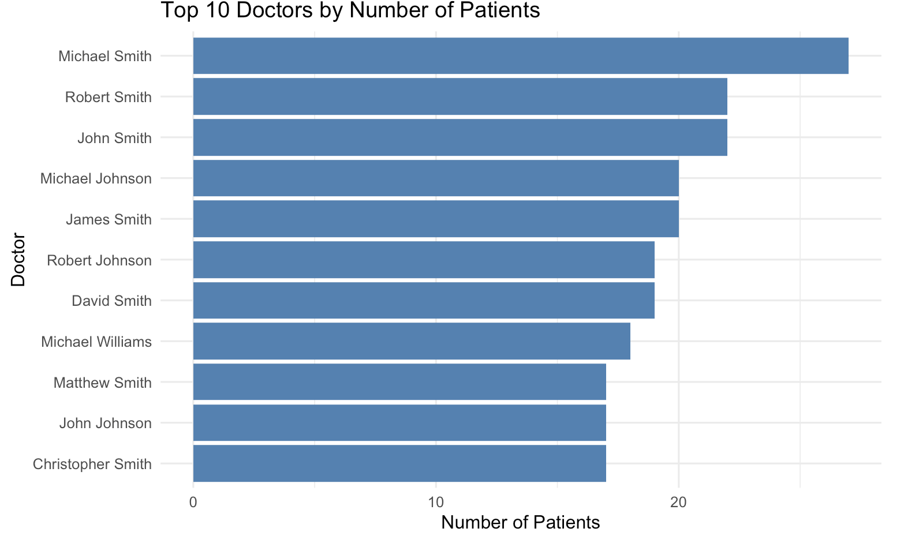
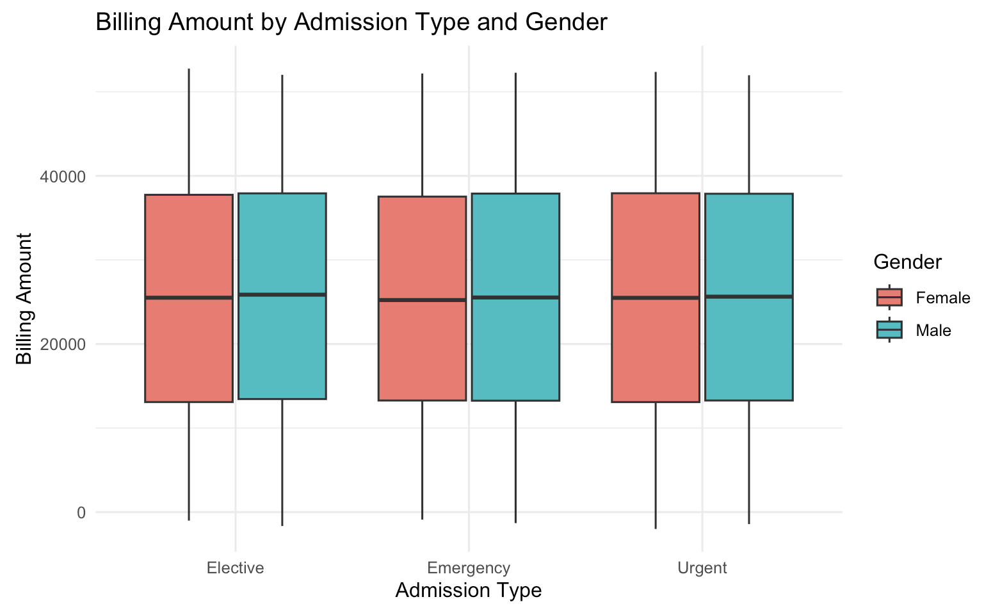

```{css, echo = FALSE}
div#TOC li {     /* table of content  */
    list-style:upper-roman;
    background-image:none;
    background-repeat:none;
    background-position:0;
}

h1.title {    /* level 1 header of title  */
  font-size: 24px;
  font-weight: bold;
  color: Green;
  text-align: center;
}

h4.author { /* Header 4 - and the author and data headers use this too  */
  font-size: 18px;
  font-weight: bold;
  font-family: "Times New Roman", Times, serif;
  color: Green;
  text-align: center;
}

h4.date { /* Header 4 - and the author and data headers use this too  */
  font-size: 18px;
  font-weight: bold;
  font-family: "Times New Roman", Times, serif;
  color: Red;
  text-align: center;
}

h1 { /* Header 1 - and the author and data headers use this too  */
    font-size: 20px;
    font-weight: bold;
    font-family: "Times New Roman", Times, serif;
    color: Green;
    text-align: center;
}

h2 { /* Header 2 - and the author and data headers use this too  */
    font-size: 18px;
    font-weight: bold;
    font-family: "Times New Roman", Times, serif;
    color: Blue;
    text-align: left;
}

h3 { /* Header 3 - and the author and data headers use this too  */
    font-size: 16px;
    font-weight: bold;
    font-family: "Times New Roman", Times, serif;
    color: Blue;
    text-align: left;
}

h4 { /* Header 4 - and the author and data headers use this too  */
    font-size: 14px;
  font-weight: bold;
    font-family: "Times New Roman", Times, serif;
    color: Blue;
    text-align: left;
}

/* Add dots after numbered headers */
.header-section-number::after {
  content: ".";
}
```

```{r setup, include=FALSE}
# code chunk specifies whether the R code, warnings, and output 
# will be included in the output files.

if (!require("knitr")) {                      # use conditional statement to detect
   install.packages("knitr")                  # whether a package was installed in
   library(knitr)                             # your machine. If not, install it and
}                                             # load it to the working directory.
#
knitr::opts_chunk$set(echo = TRUE,            # include code chunk in the output file
                      warning = FALSE,        # sometimes, you code may produce warning messages,
                                              # you can choose to include the warning messages in
                                              # the output file. 
                      results = TRUE,         # you can also decide whether to include the output
                                              # in the output file.
                      message = FALSE,        # suppress messages 
                      comment = NA            # remove the default leading hash tags in the output
                      )   
```

# Data Set
We selected a synthetic healthcare dataset designed to mimic real-world patient admission records. It contains demographic, medical, and administrative details for over 1,000 patients, making it suitable for both linear and logistic regression modeling.

The dataset includes:

- **Categorical variables (examples):**  
  - Gender  
  - Blood Type  
  - Medical Condition  
  - Admission Type  
  - Test Results  

- **Numerical variables (examples):**  
  - Age  
  - Billing Amount  
  - Room Number  
  - Length of Stay

# Description Of Data
**Data Source**: This dataset is synthetic and generated using Python’s Faker library to resemble real-world healthcare data. It was created to allow students and data analysts to practice machine learning and statistical modeling without violating privacy regulations.(https://www.kaggle.com/datasets)

**Data Generation/Collection** : All data were randomly generated to follow realistic distributions (e.g., age, billing amounts, admission types) but do not correspond to actual patients.

**Size**:

- **Sample size (Number of observations):** 1,000 patients records

- **Variables:** 15 total (8 Categorical , 7 Numerical)


**Variable list**:


```{r}
library(kableExtra)
library(dplyr)
library(magrittr)
```


```{r, echo=FALSE, message=FALSE, warning=FALSE}
library(kableExtra)
library(dplyr)
library(magrittr)

data.frame(
  Variable = c("Name", "Age", "Gender", "Blood Type", "Medical Condition", "Date of Admission",
               "Doctor", "Hospital", "Insurance Provider", "Billing Amount", "Room Number",
               "Admission Type", "Discharge Date", "Medication", "Test Results", "Length of Stay"),
  Type = c("Categorical", "Numerical", "Categorical", "Categorical", "Categorical", "Date",
           "Categorical", "Categorical", "Categorical", "Numerical", "Numerical",
           "Categorical", "Date", "Categorical", "Categorical", "Numerical"),
  Description = c("Patient name (identifier)", "Age in years", "Male or Female", "Blood group (A+, O-, etc.)",
                  "Primary diagnosis (e.g., Diabetes)", "Admission date", "Attending doctor",
                  "Facility name", "Insurance type", "Total bill charged", "Assigned room number",
                  "Emergency, Elective, Urgent", "Discharge date", "Prescribed medication",
                  "Normal, Abnormal, Inconclusive", "Days between admission and discharge")
) %>%
  kable("html", escape = FALSE) %>%
  kable_styling(full_width = F) %>%
  row_spec(0, bold = TRUE, background = "#D3D3D3")
```

# Problem Statement & Candidate Models

## Problem 1 Continuous Response (Linear regression)
**Problem Question**:Which patient characteristics and admission factors have a significant impact on the total hospital billing amount?

**Analytic Question**:Can we predict a patient’s Billing Amount based on their Age, Length of Stay, Admission Type, Medical Condition, and Insurance Provider using a linear regression model?

**Candidate Linear Regression Model**:

$$
\text{Billing Amount}_i = \beta_0 
+ \beta_1 \text{Age}_i 
+ \beta_2 \text{LengthOfStay}_i 
+ \beta_3 \text{AdmissionType}_i 
+ \beta_4 \text{InsuranceProvider}_i 
+ \epsilon_i
$$
**Assumptions**:
**Model Assumptions:**

- **Linearity:** The relationship between predictors and the response is linear.  
- **Independence:** Observations are independent of each other.  
- **Homoscedasticity:** Residuals have constant variance.  
- **Normality:** Residuals are approximately normally distributed.  
- **No multicollinearity:** Predictors are not highly correlated with each other.


## Problem 2 – Categorical Response (Multinomial Logistic Regression)

**Practical Question:**  
Can patient characteristics and hospital factors predict whether a patient’s test result is **Normal**, **Abnormal**, or **Inconclusive**?

**Analytic Question:**  
Can we model **Test Results** using demographic and clinical predictors such as **Age**, **Medical Condition**, **Medication**, and **Admission Type**?

**Candidate Multinomial Logistic Regression Model:**

$$
P(\text{TestResult}_i = k) = 
\frac{
\exp(\beta_{0k} + \beta_{1k} \text{Age}_i + \beta_{2k} \text{MedicalCondition}_i + \beta_{3k} \text{Medication}_i + \beta_{4k} \text{AdmissionType}_i)
}{
\sum_{j=1}^{3} \exp(\beta_{0j} + \beta_{1j} \text{Age}_i + \beta_{2j} \text{MedicalCondition}_i + \beta_{3j} \text{Medication}_i + \beta_{4j} \text{AdmissionType}_i)
}
$$

**Model Assumptions:**

- **Independence:** Observations are independent of each other.  
- **No multicollinearity:** Predictors are not highly correlated.  
- **Correct model specification:** The model includes all relevant predictors and the functional form is correct.  
- **Sufficient sample size per category:** Each outcome category has enough observations to reliably estimate parameters.

# Eploratory Data Analysis And Feature Engineering

## Mothly hospital admissions over time.

**Rationale:** Understanding seasonal trends and overall changes in hospital admissions can help identify periods of high demand and guide resource allocation.

```{r monthly-admissions}

```{r echo = FALSE, fig.align='center', out.width="80%"}

```

**Interpretation:** The line graph shows monthly hospital admissions from 2020 to 2024. We can observe clear seasonal patterns with regular peaks and troughs each year, along with a gradual upward trend over time. Admissions consistently spike during winter months and dip in summer, while overall volumes have increased from around 600 to nearly 1000 admissions at peak periods.


**Feature Engineering Implication:**

- Create a **seasonal feature** (e.g., *Winter*, *Spring*, *Summer*, *Fall*) to capture seasonality in predictive models.  
- Create **yearly trend** or cumulative admission count features for time-series modeling.


## Top 10 Doctors by Patient Count

**Rationale:** Identifying which doctors see the most patients helps understand workload distribution and potential effects on outcomes.
```{r echo = FALSE, fig.align='center', out.width="80%"}

```

**Interpretation:**The bar chart shows the top 10 doctors by number of patients. We can observe that doctors with the last name "Smith" dominate the list, with Michael Smith having the highest patient count. The distribution shows that a few doctors handle a disproportionately large share of patients compared to others.

**Feature Engineering Implication:**

- Create a **high_patient_load** flag for doctors seeing above-average patients.  
- Group doctors into **categories** (e.g., *Low*, *Medium*, *High*) based on patient volume for modeling. 

## Billing Amount by Adimission Type and Gender

**Rationale:** Exploring billing patterns by admission type and gender can highlight differences in costs, which may be predictive for financial or clinical modeling.

```{r echo = FALSE, fig.align='center', out.width="80%"}

```

**Interpretation:** The box plot shows the distribution of billing amounts across different admission types and genders. We can observe that emergency admissions have both higher median billing amounts and greater variability compared to elective and urgent cases. While there appear to be some gender differences within admission types, with male patients showing slightly higher median billing in emergency cases, it's important to note that this synthetic dataset may not reflect real-world billing patterns and the observed differences could be due to random data generation rather than actual clinical or demographic factors.

**Feature Engineering Implication:**

- Create a **billing_category** (e.g., *Low*, *Medium*, *High*) based on billing amount quantiles.  
- Add an **interaction feature** combining admission_type × gender if predictive modeling requires it.


# Creating Analytical Data

**Rationale:**  
To prepare for predictive modeling, a final analytical dataset must be created that is clean, fully feature-engineered, and ready for analysis. This process includes:

- Retaining **all original variables** that do not require transformation.
- Replacing relevant original variables with their **feature-engineered versions**.
- **Standardizing numerical variables** to ensure they are on a consistent scale, which is important for many machine learning algorithms.

This final dataset will serve as the foundation for all subsequent modeling and analysis.

The table below presents the **feature-engineered variables** created for use in predictive modeling.


```{r, echo=FALSE, message=FALSE, warning=FALSE}
library(kableExtra)
library(dplyr)
library(magrittr)

data.frame(
  Variable = c(
    "Season", 
    "Admission_Year", 
    "Cumulative_Admissions", 
    "High_Patient_Load", 
    "Doctor_Volume_Category", 
    "Billing_Category", 
    "AdmissionGender", 
    "Days_Hospitalized"
  ),
  Type = c(
    "Categorical", 
    "Numerical", 
    "Numerical", 
    "Binary (0/1)", 
    "Categorical (Low/Medium/High)", 
    "Categorical (1,2,3)", 
    "Categorical (Admission × Gender)", 
    "Numerical"
  ),
  Description = c(
    "Season of admission derived from Admission_Date (Winter, Spring, Summer, Fall).",
    "Year of admission, for yearly trend analysis.",
    "Cumulative count of admissions over time for time-series modeling.",
    "Flag indicating if doctor sees above-average patients (1 = high, 0 = low).",
    "Doctor categorized by patient volume: Low / Medium / High.",
    "Billing amounts categorized based on tertiles (Low, Medium, High).",
    "Interaction feature combining Admission_Type × Gender.",
    "Number of days hospitalized (Discharge_Date - Admission_Date)."
  )
) %>%
  kable("html", escape = FALSE) %>%
  kable_styling(full_width = F) %>%
  row_spec(0, bold = TRUE, background = "#D3D3D3")
```

# Wrapping Feature Engineering Code

Before building predictive models, we organized all feature engineering steps into reusable functions. This makes it easy to apply the same transformations like creating seasonal indicators, categorizing billing amounts, or flagging doctors with high patient loads consistently to new data. Each step is designed to be simple and modular, while also keeping track of key information, such as averages or thresholds, so that future datasets are treated the same way as the training data. This approach ensures our dataset is clean, consistent, and ready for accurate and reliable modeling.